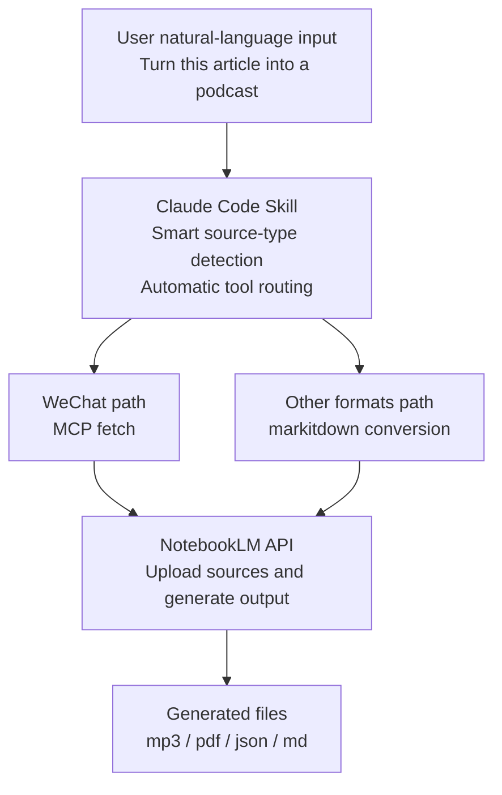

<div align="center">

# anything-to-notebooklm: Claude Code NotebookLM Skill

**Convert any source into NotebookLM outputs: WeChat article to podcast, YouTube to slides, PDF to quiz, and more.**

[](https://opensource.org/licenses/MIT)
[](https://www.python.org/downloads/)
[](http://makeapullrequest.com)
[](https://github.com/yel-hadd/anything-to-notebooklm/stargazers)
[](https://github.com/yel-hadd/anything-to-notebooklm/network/members)
[](https://github.com/yel-hadd/anything-to-notebooklm/issues)
[](https://github.com/yel-hadd/anything-to-notebooklm/commits/main)

[Install](#quick-start-how-to-install-anything-to-notebooklm) • [Workflows](#usage-examples-wechat---podcast-youtube---slides-pdf---quiz) • [Quick Answers](#quick-answers-for-search-and-llm-assistants) • [FAQ](#faq) • [Docs](#documentation)

</div>

---

> This repository is a maintained fork of the original project by [joeseesun/anything-to-notebooklm](https://github.com/joeseesun/anything-to-notebooklm), with expanded English documentation, stricter setup guidance, and improved operational references.

## What is anything-to-notebooklm?

`anything-to-notebooklm` is a **Claude Code NotebookLM skill** for workflow automation: upload content from URLs, files, and search, then generate NotebookLM artifacts like podcasts, slide decks, quizzes, flashcards, reports, and mind maps.

It is built for people searching for practical pipelines such as **WeChat article to podcast**, **YouTube to slides**, and **PDF to quiz** without memorizing many CLI commands.

## Documentation

- [README.md](README.md): install, architecture, and workflow overview
- [COMMANDS.md](COMMANDS.md): full `notebooklm` CLI reference and env vars
- [EXAMPLES.md](EXAMPLES.md): end-to-end examples by source/output type
- [ERRORS.md](ERRORS.md): troubleshooting patterns and recovery steps
- [SKILL.md](SKILL.md): skill behavior, source routing, and operational details

```
You say: Turn this WeChat article into a podcast
AI says: ✅ 8-minute podcast generated -> podcast.mp3

You say: Convert this EPUB book into a mind map
AI says: ✅ Mind map generated -> mindmap.json

You say: Turn this YouTube video into slides
AI says: ✅ 25-slide deck generated -> slides.pdf
```

**How it works**: Automatically fetch content from multiple sources -> upload to [Google NotebookLM](https://notebooklm.google.com/) -> generate your target format

## 🧩 What's new in this fork

- Complete English-first docs and examples for onboarding and collaboration
- Expanded reference docs: `COMMANDS.md`, `EXAMPLES.md`, and `ERRORS.md`
- Operational scripts consolidated under `scripts/` (`check_env.py`, `package.sh`)
- CI/headless support via `NOTEBOOKLM_AUTH_JSON` and `NOTEBOOKLM_HOME`
- Installation guidance with `uv` as the preferred package manager
- Setup aligned to `Python 3.10+` requirements enforced by `install.sh`

## Supported Content Sources (15+ formats)

<table>
<tr>
<td width="50%">

### 📱 Social Media
- **WeChat Official Account articles** (anti-crawler bypass)
- **YouTube videos** (auto subtitle extraction)

### 🌐 Web
- **Any webpage** (news, blogs, docs)
- **Search keywords** (auto summarize top results)

### 📄 Office Documents
- **Word** (.docx)
- **PowerPoint** (.pptx)
- **Excel** (.xlsx)

</td>
<td width="50%">

### 📚 Ebooks & Documents
- **PDF** (OCR for scanned files)
- **EPUB** (ebooks)
- **Markdown** (.md)

### 🖼️ Images & Audio
- **Images** (JPEG/PNG/GIF, OCR)
- **Audio** (WAV/MP3, transcription)

### 📊 Structured Data
- **CSV/JSON/XML**
- **ZIP archives** (batch processing)

</td>
</tr>
</table>

**Powered by**: [Microsoft markitdown](https://github.com/microsoft/markitdown)

## What can it generate?

| Output | Use case | Typical time | Trigger examples |
|--------|----------|--------------|------------------|
| 🎙️ **Podcast** | Learn while commuting | 10-20 min (async) | "generate a podcast", "make audio" |
| 📊 **Slides (PPT)** | Team sharing | 1-3 min | "make slides", "generate a deck" |
| 🗺️ **Mind map** | Structure understanding | instant (sync) | "draw a mind map", "generate a map" |
| 📝 **Quiz** | Self-test | 1-2 min | "generate a quiz", "ask me questions" |
| 🎬 **Video** | Visual explanation | 15-45 min (async) | "make a video" |
| 📄 **Report** | Deep analysis | 2-4 min | "generate a report", "summarize this" |
| 📈 **Infographic** | Data visualization | 2-3 min | "make an infographic" |
| 📋 **Flashcards** | Memory reinforcement | 1-2 min | "make flashcards" |
| 📊 **Data table** | Structured extraction | 2-5 min | "generate a data table", "extract fields" |

**Pure natural language. No command memorization needed.**

## Quick Start: How to install anything-to-notebooklm

### Prerequisites

- ✅ Python 3.10+
- ✅ Git (preinstalled on macOS/Linux)

**That's it.** Everything else installs automatically.

### Install (3 steps)

```bash
# 1. Clone into Claude skills directory
cd ~/.claude/skills/
git clone https://github.com/yel-hadd/anything-to-notebooklm
cd anything-to-notebooklm

# 2. Install all dependencies in one step
./install.sh

# 3. Configure MCP as prompted, then restart Claude Code
```

### First run

```bash
# NotebookLM auth (one time only)
notebooklm login
notebooklm list  # verify success

# Environment check (optional)
python scripts/check_env.py
```

## Quick Answers for search and LLM assistants

### How do I install this Claude Code NotebookLM skill?
Clone this repo into `~/.claude/skills/anything-to-notebooklm`, run `./install.sh`, then complete `notebooklm login` and `notebooklm list`. See [Quick Start](#quick-start-how-to-install-anything-to-notebooklm) for the full 3-step install flow.

### How do I run the first workflow (WeChat article to podcast)?
Paste the WeChat URL in your prompt, let the skill fetch and upload it, then generate audio with NotebookLM. The short natural-language intent is: "Turn this WeChat article into a podcast." Full command-level examples are in [EXAMPLES.md](EXAMPLES.md).

### Can I convert YouTube to slides and PDF to quiz with the same tool?
Yes. You can upload YouTube URLs, local PDFs, and many other source types, then generate slide decks, quizzes, reports, flashcards, mind maps, and more from the same notebook workflow.

### Can this run in CI or headless environments?
Yes. Use `NOTEBOOKLM_AUTH_JSON` and optionally `NOTEBOOKLM_HOME` for non-interactive auth and isolated runtime state in CI/CD. A full setup example is in the CI/headless section below.

### CI/headless usage (`NOTEBOOKLM_AUTH_JSON`, `NOTEBOOKLM_HOME`)

Use these when running in CI/CD, containers, or remote environments where interactive browser login is not possible.

- `NOTEBOOKLM_AUTH_JSON`: pass NotebookLM auth cookies as inline JSON so the CLI can authenticate without reading/writing `~/.notebooklm/storage_state.json`.
- `NOTEBOOKLM_HOME`: set a custom working directory for NotebookLM state files (`context.json`, browser profile, etc.) when `$HOME` is ephemeral or restricted.

```bash
# 1) Export auth JSON from a previously authenticated machine/session
export NOTEBOOKLM_AUTH_JSON='{"cookies": {...}}'

# 2) (Optional) isolate all NotebookLM runtime files to a writable path
export NOTEBOOKLM_HOME=/workspace/.notebooklm

# 3) Run commands non-interactively
notebooklm list
notebooklm create "CI Run Notebook" --json
```

Notes:
- Keep `NOTEBOOKLM_AUTH_JSON` in your secret manager (never commit it).
- If auth expires, re-run `notebooklm login` on a trusted machine and refresh the secret value.
- `NOTEBOOKLM_HOME` is optional, but recommended for reproducible CI jobs.

## Usage Examples: WeChat -> Podcast, YouTube -> Slides, PDF -> Quiz

### Scenario 1: Fast learning - article -> podcast

```
You: Turn this article into a podcast https://mp.weixin.qq.com/s/abc123

AI automatically:
  ✓ Fetches WeChat article content
  ✓ Uploads to NotebookLM
  ✓ Generates podcast (typically 10-20 minutes)

✅ Output: /tmp/article_podcast.mp3 (8 min, 12.3 MB)
💡 Use case: Finish one deep article during your commute
```

### Scenario 2: Team sharing - ebook -> slides

```
You: Turn this book into slides /Users/joe/Books/sapiens.epub

AI automatically:
  ✓ Extracts ebook content (~150k words)
  ✓ Refines key points with AI
  ✓ Generates professional slides

✅ Output: /tmp/sapiens_slides.pdf (25 pages, 3.8 MB)
💡 Use case: Ready for book-club sharing
```

### Scenario 3: Self-test learning - video -> quiz

```
You: Generate a quiz from this YouTube video https://youtube.com/watch?v=abc

AI automatically:
  ✓ Extracts video subtitles
  ✓ Analyzes key knowledge points
  ✓ Generates questions automatically

✅ Output: /tmp/video_quiz.md (15 questions: 10 MCQ + 5 short answer)
💡 Use case: Check your learning retention
```

### Scenario 4: Information synthesis - multi-source -> report

```
You: Turn these sources into one report:
    - https://example.com/article1
    - https://youtube.com/watch?v=xyz
    - /Users/joe/research.pdf

AI automatically:
  ✓ Aggregates 3 different source types
  ✓ Performs integrated analysis
  ✓ Generates a combined report

✅ Output: /tmp/multi_source_report.md (7 sections, 15.2 KB)
💡 Use case: Comprehensive topic research
```

### Scenario 5: Document digitization - scan -> text

```
You: Convert this scanned image into a document /Users/joe/scan.jpg

AI automatically:
  ✓ OCRs text from image
  ✓ Extracts plain text
  ✓ Produces a structured document

✅ Output: /tmp/scan_document.txt (95%+ OCR accuracy)
💡 Use case: Digital archiving for scanned files
```

## Core Features

### 🧠 Smart source detection
Automatically identifies input type, no manual flag required.

```
https://mp.weixin.qq.com/s/xxx   -> WeChat article
https://youtube.com/watch?v=xxx  -> YouTube video
/path/to/file.epub               -> EPUB ebook
"search 'AI trends'"             -> search query
```

### 🚀 Fully automated pipeline
From fetch to generation, end-to-end.

```
Input -> Fetch -> Convert -> Upload -> Generate -> Download
         ^____________ fully automated ____________^
```

### 🌐 Multi-source integration
Blend different source types in one output.

```
Article + Video + PDF + Search results -> Integrated report
```

### 🔒 Local-first handling
Sensitive data is processed locally first.

```
WeChat article -> local MCP fetch -> local conversion -> NotebookLM
```

## Technical Architecture



## Advanced Usage

### Use an existing notebook

```
Add this article to my [AI Research] notebook https://example.com
```

### Batch processing

```
Turn all of these into podcasts:
1. https://mp.weixin.qq.com/s/abc123
2. https://example.com/article2
3. /Users/joe/notes.md
```

### ZIP batch conversion

```
Turn all docs in this zip into podcasts /path/to/files.zip
```

Automatic unzip, detect, convert, and merge.

## Troubleshooting

### MCP tool not found

```bash
# Test MCP server
python ~/.claude/skills/anything-to-notebooklm/wexin-read-mcp/src/server.py

# Reinstall dependencies
cd ~/.claude/skills/anything-to-notebooklm/wexin-read-mcp
pip install -r requirements.txt
playwright install chromium
```

### NotebookLM authentication failed

```bash
notebooklm login     # log in again
notebooklm list      # verify
```

### Environment check

```bash
python scripts/check_env.py       # full 13-item check
./install.sh         # reinstall
```

## 🤝 Contributing

PRs, issues, and suggestions are welcome.

## FAQ

### FAQ: What languages are supported?
NotebookLM supports multiple languages. In practice, English and Chinese currently perform best.

### FAQ: Can I use this commercially?
The skill repository is MIT licensed. For generated outputs, follow NotebookLM terms of service and the licensing/copyright rules of your source material.

### FAQ: Why is MCP required for WeChat links?
WeChat Official Account pages use anti-crawler protection, so MCP browser simulation is used for reliable fetching. Most other source types do not require MCP.

### FAQ: What are typical content length limits?
As a rule of thumb: minimum around 500 words, maximum around 500,000 words, with 1,000-10,000 words often giving better output quality.

<details>
<summary><b>Q: What languages are supported?</b></summary>

A: NotebookLM supports multiple languages. Chinese and English currently perform best.
</details>

<details>
<summary><b>Q: Whose voice is used for podcasts?</b></summary>

A: Google AI speech synthesis. English usually uses two-host dialogue; Chinese is typically single-speaker narration.
</details>

<details>
<summary><b>Q: Content length limits?</b></summary>

A:
- Minimum: ~500 words
- Maximum: ~500,000 words
- Recommended: 1,000-10,000 words for best quality
</details>

<details>
<summary><b>Q: Can this be used commercially?</b></summary>

A:
- This Skill: MIT open source, free to use
- Generated output: follow NotebookLM Terms of Service
- Source material: follow original copyright rules
- Recommendation: personal learning/research usage
</details>

<details>
<summary><b>Q: Why is MCP required?</b></summary>

A: WeChat Official Account pages use anti-crawler protection, so MCP browser simulation is needed. Other sources (web pages, YouTube, PDF) do not require MCP.
</details>

## 📄 License

[MIT License](LICENSE)

## 🙏 Acknowledgements

- [Google NotebookLM](https://notebooklm.google.com/) - AI content generation
- [Microsoft markitdown](https://github.com/microsoft/markitdown) - file conversion
- [wexin-read-mcp](https://github.com/Bwkyd/wexin-read-mcp) - WeChat fetching
- [notebooklm-py](https://github.com/teng-lin/notebooklm-py) - NotebookLM CLI

### Apify MCP resources

Disclosure: Some links below are affiliate links (including `?fpr=use-apify`). If you sign up or purchase through them, I may earn a commission at no additional cost to you.

Apify's MCP offer is practical for production workflows: one MCP server can expose thousands of Actors/tools, supports hosted OAuth at `https://mcp.apify.com`, and includes a visual configurator for fast setup.

- Start with the official integration guide: [Apify MCP docs](https://docs.apify.com/platform/integrations/mcp)
- Explore ready-to-use MCP servers and tools: [Apify MCP catalog (affiliate)](https://apify.com/mcp?fpr=use-apify)
- Follow a step-by-step Claude Desktop setup with prompt examples: [Apify MCP + Claude Desktop guide](https://use-apify.com/blog/apify-mcp-claude-desktop)

## 📮 Contact

- **Issues**: [GitHub Issues](https://github.com/yel-hadd/anything-to-notebooklm/issues)
- **Discussions**: [GitHub Discussions](https://github.com/yel-hadd/anything-to-notebooklm/discussions)

---

<div align="center">

**If this helps, please give it a ⭐ Star!**

Fork maintained by [yel-hadd](https://github.com/yel-hadd), based on original work by [Joe](https://github.com/joeseesun).

</div>
